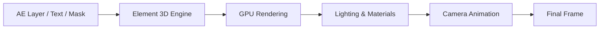

# Element 3D (Video Copilot) 

Some tools ask you to wait.
Others ask you to *believe*.

**Element 3D** does neither.
It simply renders — instantly, decisively, without hesitation.

This is the moment when After Effects stops pretending to be flat. When layers gain depth, text gains weight, and imagination finally steps into the third dimension without leaving the timeline.

Created by **Video Copilot**, **Element 3D** is a GPU-accelerated 3D object and text renderer that lives natively inside After Effects. No external roundtrips. No offline previews. Just real-time 3D — responsive as thought itself.

---

## Overview 🧱

**Element 3D** allows you to import, texture, light, and animate true 3D geometry directly inside After Effects.

It was built for artists who:

* Love AE’s animation tools
* Need real 3D depth
* Refuse slow render pipelines

Logos, titles, abstract shapes, motion graphics scenes — all rendered through your GPU, all adjustable live.

---

## What Element 3D Brings to Life ✨

Element 3D is not a full 3D package.
It is something more focused — and therefore faster.

### 🔺 Real-Time 3D Rendering

The core magic.

* GPU-powered rendering
* True depth, reflections, shadows
* Near-instant previews
* No offline calculation loops

This alone changes how you *think* while designing.

---

### 🆎 3D Text & Logos

Typography with mass.

* Extruded text and masks
* Bevels, chamfers, depth control
* Perfect for logo reveals
* Clean, sharp edges

Ideal for:

* Title sequences
* Brand intros
* Cinematic openers

---

### 📦 3D Object Import

Bring your models home.

* OBJ and C4D file support
* Multi-object scenes
* Group-based animation
* Clean hierarchy control

Element 3D thrives with:

* Abstract geometry
* Product parts
* Motion-focused assets

> [!NOTE]
> Element 3D favors motion graphics models over film-level complexity — elegance beats excess.

---

### 🎨 Materials, Textures & Reflections

Surface tells the story.

* Custom textures
* Reflection maps
* Metallic, glass, plastic looks
* Environment lighting

Materials update live — experimentation becomes addictive.

---

### 💡 Lighting & AE Camera Integration

Light follows intent.

* Native After Effects lights
* Real-time shadows
* Depth-of-field support
* Full AE camera compatibility

Your existing AE knowledge carries forward effortlessly.

---

## Why Element 3D Changed Motion Design ⚡

Because it removed waiting from the equation.

**Creative impact**

* Encourages exploration
* Reduces fear of complexity
* Keeps ideas fluid
* Makes 3D feel playful

**Technical strengths**

* Extremely fast rendering
* Stable on modern GPUs
* Works entirely inside AE
* Zero external render passes

This plugin didn’t just add a feature — it reshaped workflows.

---

## Typical Workflow 🌊

1. Create text, shape, or solid
2. Apply Element 3D
3. Open Scene Setup
4. Import or build geometry
5. Apply materials
6. Animate with AE tools

No exporting.
No re-importing.
Just depth — immediately.

---

## Real-Time Rendering Flow 🔁

The loop is fast enough to think inside it.

---

## Frequently Asked Questions ❓

**Is Element 3D good for beginners?**
Yes — especially for motion designers new to 3D.

**Can it replace Blender or Cinema 4D?**
No. It complements them, focusing on speed and motion.

**Is it still relevant in 2026?**
Very much so — speed never goes out of style.

**Does it support complex simulations?**
No — and that’s the point. Element 3D stays lean.

**Is it good for logo animation?**
It remains one of the best tools available for that purpose.

> [!IMPORTANT]
> Clean models and optimized textures unlock Element 3D’s full performance.

---

## Philosophy of the Plugin 🌌

Element 3D does not chase realism.
It chases *responsiveness*.

It understands that motion design is about rhythm, timing, and iteration — and that waiting breaks all three.

This is 3D without intimidation.
Depth without delay.
Power without friction.

---

## Final Thoughts 🌠

Element 3D is not loud.
It doesn’t promise the world.

It simply opens a door —
and lets motion designers step into space without leaving home.

Once you animate 3D like this — fast, tactile, alive — going back feels like drawing shadows instead of objects.

Solid forms.
Instant feedback.
A timeline that finally breathes in three dimensions.

---
